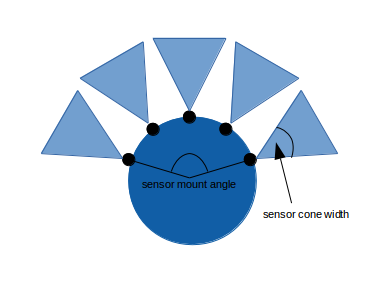

Tag der offenen Tür
===================

17.03.2016
----------

In dem beiliegenden Demo-Programm **[AI]-Bot** ein autonomer, d.h. sich selbst steuernder, Roboter simuliert. Der **[AI]-Bot** kann sich drehen und vorwärts bewegen, aber nicht seitwärts. Er ist mit Sensoren ausgestattet, die nach Vorne gerichtet in gleichem Abstand angebracht sind und in einem gewissen Winkel die Entfernung zum nächsten Gegenstand messen.

Ziel ist es, den Roboter Hindernissen ausweichen zu lassen. Dazu dreht er nach rechts ab, wenn die Sensoren auf der linken Seite Hindernisse erkennen (und umgekehrt). Außerdem wird er langsamer, wenn er auf ein Hindernis zu fährt. Hierbei gibt es viele Parameter, die die Performance des Roboters beeinflussen:

* **sensor mount angle** Der Winkel, auf dem die Sensoren angeordnet sind
* **sensor cone width** Der Winkel, in dem ein einzelner Sensor Hindernisse wahrnimmt
* **number of sensors** Die Anzahl der angebrachten Sensoren
* **maximum speed** Die Höchstgeschwindigkeit bei freier Bahn
* **repulsion force** Wie stark der Roboter von einem Hindernis weg rotiert
* **distance decay** Umso größer dieser Wert ist, umso mehr ignoriert der Roboter Hindernisse die weiter entfernt sind.
